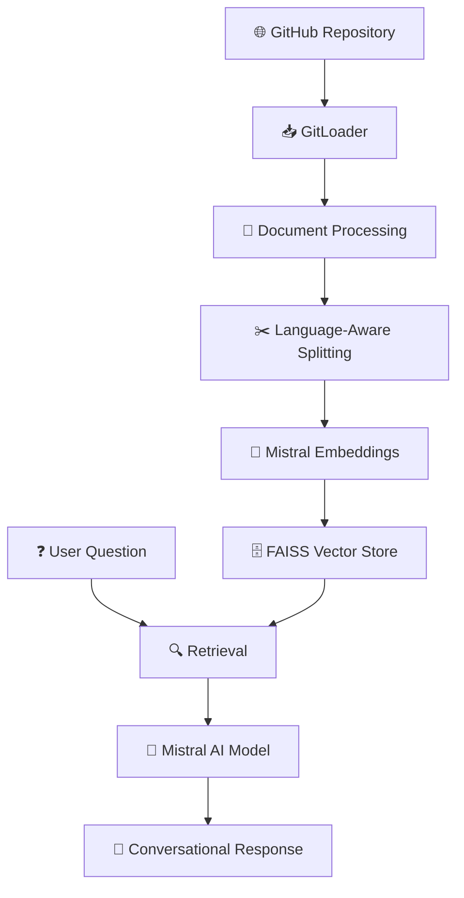

# 🧠 RAG Codebase Chatbot
[](https://www.python.org/downloads/)
[](https://langchain.com/)
[](https://mistral.ai/)
[](https://gradio.app/)


> 🚀 **Chat with any GitHub repository using advanced RAG (Retrieval Augmented Generation) technology!**

A superintelligent AI chatbot that can analyze, understand, and answer questions about any GitHub codebase. Simply provide a repository URL and start asking questions about the code structure, functionality, and implementation details.

[latest2.webm](https://github.com/user-attachments/assets/75210f36-a4e0-4773-973f-e2fe49d366d6)


## ✨ Features

- 🔍 **Repository Analysis**: Automatically clones and analyzes any public GitHub repository
- 🧩 **Smart Code Splitting**: Language-aware document splitting that respects code structure
- 🎯 **Intelligent Retrieval**: FAISS-powered vector search for relevant code snippets
- 💬 **Conversational Interface**: Memory-enabled chat that maintains context across questions
- 🌐 **Web Interface**: User-friendly Gradio interface for easy interaction
- 🚀 **Multi-language Support**: Supports 15+ programming languages including Python, JavaScript, Java, C++, and more

## 🛠️ Technology Stack

- **🤖 AI Model**: Mistral AI Large (mistral-large-latest)
- **🔗 Framework**: LangChain for RAG pipeline
- **📊 Vector Store**: FAISS for efficient similarity search
- **🎨 Interface**: Gradio for web-based interaction
- **📝 Embeddings**: Mistral AI Embeddings (mistral-embed)

## 📋 Prerequisites

- Python 3.7 or higher
- Mistral AI API key
- Internet connection for repository cloning

## 🚀 Installation

### 1. Clone this repository
```bash
git clone <your-repo-url>
cd rag-codebase-chatbot
```

### 2. Install required packages
```bash
pip install -qU "langchain[mistralai]"
pip install -U langchain-community
pip install gitpython
pip install --upgrade langchain
pip install langchain-deeplake deeplake
pip install -qU langchain-mistralai
pip install langchain faiss-cpu
pip install gradio
```

### 3. Set up Mistral AI API Key
You'll be prompted to enter your API key when running the application, or you can set it as an environment variable:
```bash
export MISTRAL_API_KEY="your-api-key-here"
```

## 🎯 Usage

### 🖥️ Running the Application

1. **Start the chatbot**:
   ```bash
   python chat_with_you_any_repo.py
   ```

2. **Open your browser** and navigate to the provided local URL (usually `http://127.0.0.1:7860`)

3. **Enter a GitHub repository URL** in the first field

4. **Ask your question** about the codebase in the second field

5. **Get intelligent answers** powered by RAG technology!

### 📝 Example Usage

**Repository URL**: `https://github.com/username/awesome-project`

**Sample Questions**:
- 🔍 "What is the main functionality of this project?"
- 🏗️ "How is the code structured and organized?"
- 🐛 "Are there any potential bugs or issues in the authentication module?"
- 📚 "Can you explain how the database connection is handled?"
- 🔧 "What design patterns are used in this codebase?"

## 🗂️ Supported File Types

The chatbot intelligently processes various file types:

| Language | Extensions | Splitting Strategy |
|----------|------------|-------------------|
| 🐍 Python | `.py` | Function and class aware |
| 🌐 JavaScript/TypeScript | `.js`, `.jsx`, `.ts`, `.tsx` | Function and object aware |
| ☕ Java | `.java` | Class and method aware |
| ⚡ C++ | `.cpp` | Function and class aware |
| 🦀 Rust | `.rs` | Function and struct aware |
| 💎 Ruby | `.rb` | Method and class aware |
| 🐹 Go | `.go` | Function aware |
| 📱 Swift | `.swift` | Function and class aware |
| 📋 Markdown | `.md` | Header aware |
| 🎨 HTML/CSS | `.html`, `.htm`, `.css` | Tag aware |
| 📄 Others | `.json`, `.txt`, `.ipynb` | Generic splitting |

## 🏗️ Architecture



## 🔧 Core Components

### 1. 📥 Repository Loader
```python
def load_github_repo(repo_url: str, branch: str = "main", repo_path: str = "./repo") -> list:
    # Clones and loads repository content using GitLoader
```

### 2. ✂️ Smart Document Splitter
- **Language Detection**: Automatically detects programming language from file extensions
- **Structure-Aware Splitting**: Respects code structure (functions, classes, methods)
- **Configurable Chunks**: Customizable chunk size and overlap

### 3. 🗄️ Vector Storage
- **FAISS Integration**: High-performance similarity search
- **Mistral Embeddings**: State-of-the-art embedding model
- **Persistent Storage**: Saves indices for reuse

### 4. 🤖 Conversational Chain
- **Memory Management**: Maintains conversation context
- **Retrieval Integration**: Combines relevant code snippets
- **Intelligent Responses**: Context-aware answers

## ⚙️ Configuration

### Chunk Settings
```python
chunk_size = 1000      # Maximum characters per chunk
chunk_overlap = 200    # Overlapping characters between chunks
```

### Model Configuration
```python
model = "mistral-large-latest"    # AI model for responses
embeddings = "mistral-embed"      # Embedding model for vector search
```

## 🐛 Troubleshooting

### Common Issues

**❌ Repository Not Found**
- Ensure the GitHub URL is correct and the repository is public
- Check your internet connection

**❌ API Key Error**
- Verify your Mistral AI API key is valid
- Check if you have sufficient API credits

**❌ Memory Issues**
- For large repositories, consider reducing `chunk_size`
- Close other applications to free up RAM

**❌ Gradio Interface Not Loading**
- Try a different port: `iface.launch(server_port=7861)`
- Check if port 7860 is already in use

## 🤝 Contributing

We welcome contributions! Here's how to get started:

1. 🍴 Fork the repository
2. 🌿 Create a feature branch: `git checkout -b feature/amazing-feature`
3. 💾 Commit your changes: `git commit -m 'Add amazing feature'`
4. 📤 Push to the branch: `git push origin feature/amazing-feature`
5. 🔄 Open a Pull Request

## 📄 License

This project is licensed under the MIT License - see the [LICENSE](LICENSE) file for details.

## 🙏 Acknowledgments

- 🎯 **LangChain** for the RAG framework
- 🤖 **Mistral AI** for powerful language models
- 🎨 **Gradio** for the intuitive web interface
- 🔍 **FAISS** for efficient vector search
- 👨‍💻 **Open Source Community** for inspiration and support

## 📞 Support

- 📧 **Email**: your-email@example.com
- 🐛 **Issues**: [GitHub Issues](https://github.com/your-username/your-repo/issues)
- 💬 **Discussions**: [GitHub Discussions](https://github.com/your-username/your-repo/discussions)

---

<div align="center">

**🌟 Star this repository if you find it helpful! 🌟**

Made with ❤️ by [Your Name]

</div>
